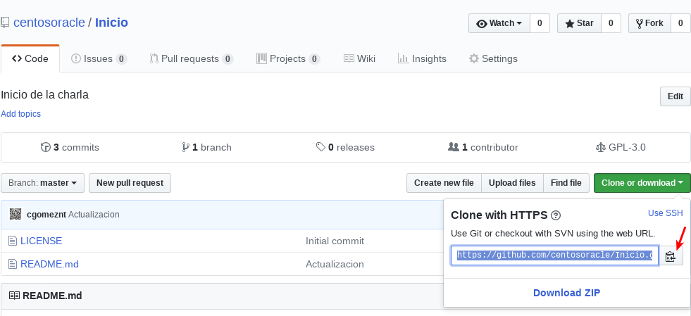
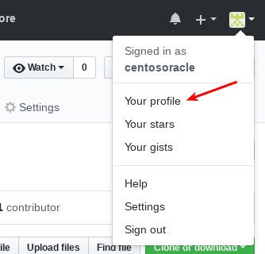
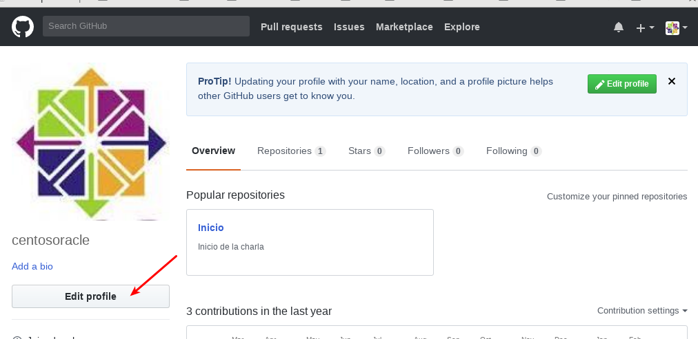
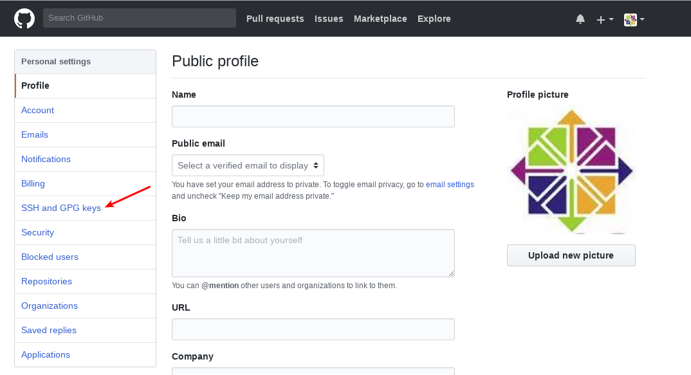
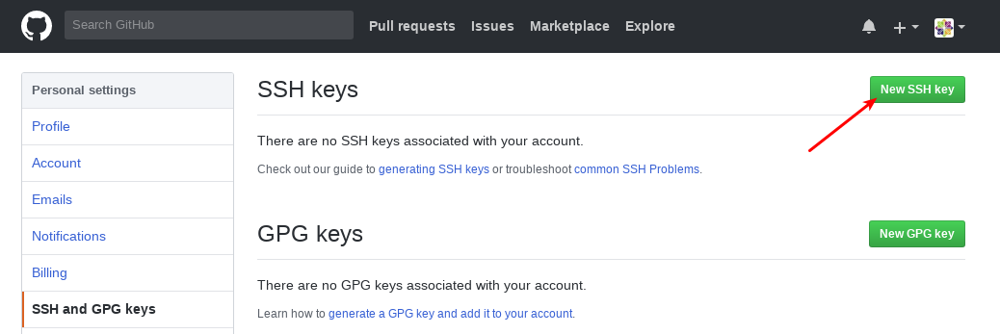
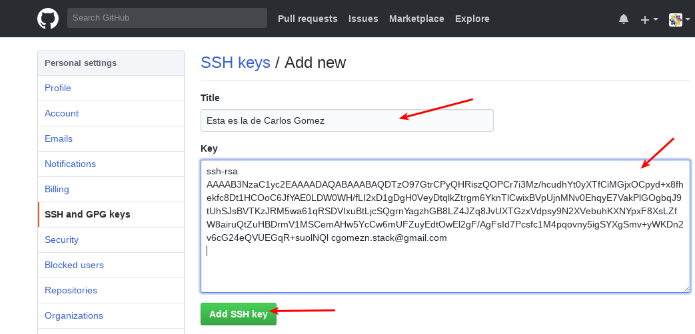
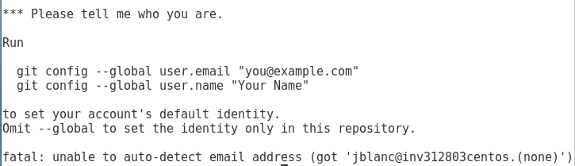

Algo de GitHub, Jose Blanco
==============

Esto tambien le sirve para que vayan viendo el documento en "rst", vayan corrigiendo los errores de hortografiA

Como descargar el Repositorio de GitHub a local
+++++++++++++++++++++++++++++++++++++++++++++++

Copien desde GitHub la ruta del repositorio.

Esto lo vamos hacer siempre desde un terminal en Linux.

En el terminal creamos un directorio.::

	$ mkdir centosoracle

Ingresamos al direcctorio.::

	$ cd centosoracle

Luego instale (solo para debian o Ubuntu):

::	# apt-get update

::	# apt install git-hub

::	# exit

Para instalar en Centos7, sigue este tutorial:

::https://www.digitalocean.com/community/tutorials/how-to-install-git-on-centos-7

Ahora vamos a prepara dicho directorio para que descargue el repositorio de Githup.::

	$ git init

	$ git remote add origin https://github.com/centosoracle/Inicio.git

	$ git pull origin master
	remote: Counting objects: 3, done.
	remote: Compressing objects: 100% (2/2), done.
	Unpacking objects: 100% (3/3), done.
	remote: Total 3 (delta 0), reused 0 (delta 0), pack-reused 0
	From https://github.com/centosoracle/Inicio
	 * branch            master     -> FETCH_HEAD
	 * [new branch]      master     -> origin/master

Listo, ya tienen el repo en local, luego veremos como hacemos para subir la informacion.

Como hacer que GitHub acepte nuestras modificaciones
++++++++++++++++++++++++++++++++++++++++++++++++++++

Vamos a configurar nuestro equipo local para que podamos tener sincronizado nuestros repositorios contra el Github. Esto es lo que nos permitira hacer modificaciones en nuestros equipos "repositorios locales" y subirlo al Github "Repositorio de Github"

Github necesita saber quienes estan autorizado para subir informacion y para lograr eso lo hace gracias a las llaves publicas "Si no sabemos como se crean las llaves publicas, sigue este procedimiento https://github.com/centosoracle/Inicio/blob/master/guia/llavepublica.rst ...!!! ", pero si saben hagamos lo sigueinte, no lo voy a explicar solo dejo las imagenes.

Como subir modificaciones locales al Repositorio de GitHub
+++++++++++++++++++++++++++++++++++++++++++++++++++++++++++

Luego que ustedes ya tengan el repositorio en local lo pueden editar con el editor de su preferencia.::

	$ vi guia/github.rst

luego de guardar los cambios, con los comando de git, vamos a indicarle que agregue todos los archivo que han sido modificados.::

	$ git add *

Debemos decirle a GITHUB quien esta modificando, para esto seguimos los comandos de la imagen:

Ahora debemos confirmar las modificaciones con un "commit", siempre es bueno en el commit colocar quien realizo el cambio, por si existe un error podamos reversar al archivo a la version anterior.::

	$ git commit -m "Actualizacion de CGG"
	[master ab32eef] Actualizacion de CGG
	 1 file changed, 11 insertions(+)

Ya el repositorio local esta listo para mandar las modificaciones al repositorio de Github y para eso hacemos.::

	$ git push origin master
	Username for 'https://github.com': centosoracle
	Password for 'https://centosoracle@github.com': 
	Counting objects: 4, done.
	Delta compression using up to 4 threads.
	Compressing objects: 100% (4/4), done.
	Writing objects: 100% (4/4), 689 bytes | 0 bytes/s, done.
	Total 4 (delta 1), reused 0 (delta 0)
	remote: Resolving deltas: 100% (1/1), completed with 1 local object.
	To https://github.com/centosoracle/Inicio.git
	   7ecee39..ab32eef  master -> master

Y ya podran ver sus cambios realizados en la pagina de Github

